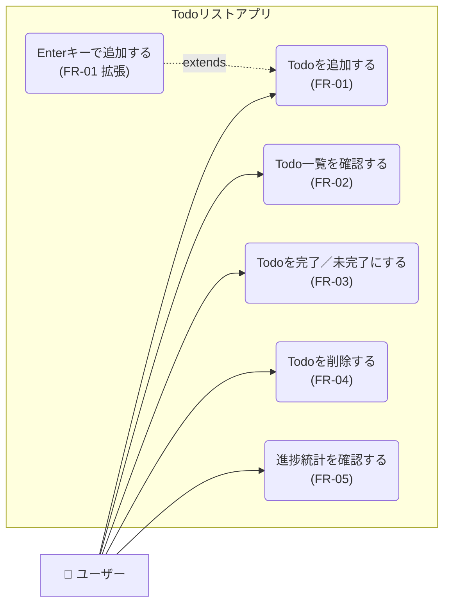

# 要件定義書

| 項目 | 内容 |
|------|------|
| 文書名 | 要件定義書 |
| プロジェクト名 | Todoリスト作成アプリ |
| バージョン | 1.0 |
| 作成日 | 2026-04-23 |
| 作成者 | okataku0130 |

---

## 1. 目的

本文書は、要求仕様書に基づきシステムが実現すべき機能要件・非機能要件を定義する。

---

## 2. システム概要

本システムは、Node.js（Express）をバックエンドとし、HTML/CSS/JavaScriptをフロントエンドとしたWebアプリケーションである。ユーザーはブラウザからTodoタスクの追加・完了・削除を行う。データはサーバーのメモリ上に保持する。

---

## 3. ユースケース図



### ユースケース一覧

| ユースケースID | ユースケース名 | アクター | 関連要件 |
|-------------|-------------|---------|---------|
| UC-01 | Todoを追加する | ユーザー | FR-01 |
| UC-02 | Todo一覧を確認する | ユーザー | FR-02 |
| UC-03 | Todoを完了/未完了にする | ユーザー | FR-03 |
| UC-04 | Todoを削除する | ユーザー | FR-04 |
| UC-05 | 進捗統計を確認する | ユーザー | FR-05 |
| UC-06 | Enterキーで追加する | ユーザー | FR-01（拡張） |

---

## 4. 機能要件

### 3.1 Todo追加機能

| 項目 | 内容 |
|------|------|
| 要件ID | FR-01 |
| 機能名 | Todo追加 |
| 概要 | ユーザーがテキストを入力し、追加ボタンまたはEnterキーで新しいTodoを登録する |
| 入力 | タスク名（文字列） |
| 処理 | 入力値の空白チェック → サーバーへPOSTリクエスト → リスト再描画 |
| 出力 | Todoリストに新規アイテムが追加される |
| 例外 | 空文字または空白のみの場合は追加しない |

### 3.2 Todo一覧表示機能

| 項目 | 内容 |
|------|------|
| 要件ID | FR-02 |
| 機能名 | Todo一覧表示 |
| 概要 | 登録されているすべてのTodoをリスト形式で表示する |
| 入力 | なし（ページ読み込み時・操作後に自動取得） |
| 処理 | サーバーへGETリクエスト → 全Todoデータ取得 → DOM生成 |
| 出力 | タスク名・完了状態・削除ボタンを含む一覧 |
| 例外 | Todoが0件の場合は「タスクがありません」と表示する |

### 3.3 Todo完了切替機能

| 項目 | 内容 |
|------|------|
| 要件ID | FR-03 |
| 機能名 | 完了/未完了の切替 |
| 概要 | チェックボックス操作でTodoの完了状態をトグルする |
| 入力 | TodoのID |
| 処理 | サーバーへPATCHリクエスト → completed フラグを反転 → リスト再描画 |
| 出力 | 完了状態のタスクに打ち消し線・グレー表示が適用される |

### 3.4 Todo削除機能

| 項目 | 内容 |
|------|------|
| 要件ID | FR-04 |
| 機能名 | Todo削除 |
| 概要 | 削除ボタン（✕）を押下したTodoをリストから除去する |
| 入力 | TodoのID |
| 処理 | サーバーへDELETEリクエスト → 該当Todoを配列から削除 → リスト再描画 |
| 出力 | 対象Todoがリストから消える |

### 3.5 進捗表示機能

| 項目 | 内容 |
|------|------|
| 要件ID | FR-05 |
| 機能名 | 進捗統計表示 |
| 概要 | 総タスク数と完了タスク数をリスト上部に表示する |
| 出力 | 「N件中 M件完了」形式のテキスト |

---

## 5. 非機能要件

### 4.1 パフォーマンス

| 要件ID | 内容 | 目標値 |
|--------|------|--------|
| NFR-01 | API応答時間 | 通常操作で100ms以内 |
| NFR-02 | 画面更新 | 操作後即座に再描画（体感遅延なし） |

### 4.2 ユーザビリティ

| 要件ID | 内容 |
|--------|------|
| NFR-03 | キーボードのEnterキーでTodoを追加できること |
| NFR-04 | シンプルで直感的なUIレイアウトであること |
| NFR-05 | 完了タスクは視覚的に区別できること（打ち消し線・色変更） |

### 4.3 信頼性

| 要件ID | 内容 |
|--------|------|
| NFR-06 | サーバー稼働中はデータが消えないこと |
| NFR-07 | 入力値のバリデーションを行い、不正データを登録しないこと |

### 4.4 保守性

| 要件ID | 内容 |
|--------|------|
| NFR-08 | サーバー側とクライアント側のコードを分離すること |
| NFR-09 | REST APIの設計原則に従うこと |

---

## 6. システム境界

```
[ブラウザ（ユーザー）]
        ↕ HTTP (port 3000)
[Node.js / Express サーバー]
        ↕ メモリ内配列
[データストア（In-Memory）]
```

---

## 7. 機能一覧

| 要件ID | 機能名 | 優先度 |
|--------|--------|--------|
| FR-01 | Todo追加 | 必須 |
| FR-02 | Todo一覧表示 | 必須 |
| FR-03 | 完了/未完了切替 | 必須 |
| FR-04 | Todo削除 | 必須 |
| FR-05 | 進捗統計表示 | 推奨 |
